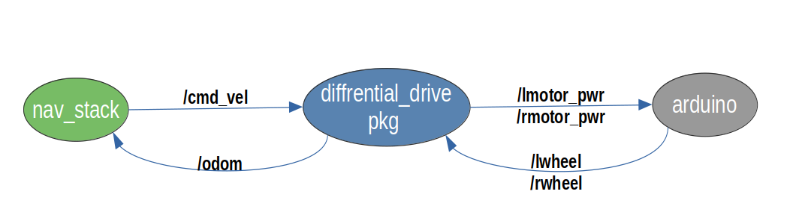
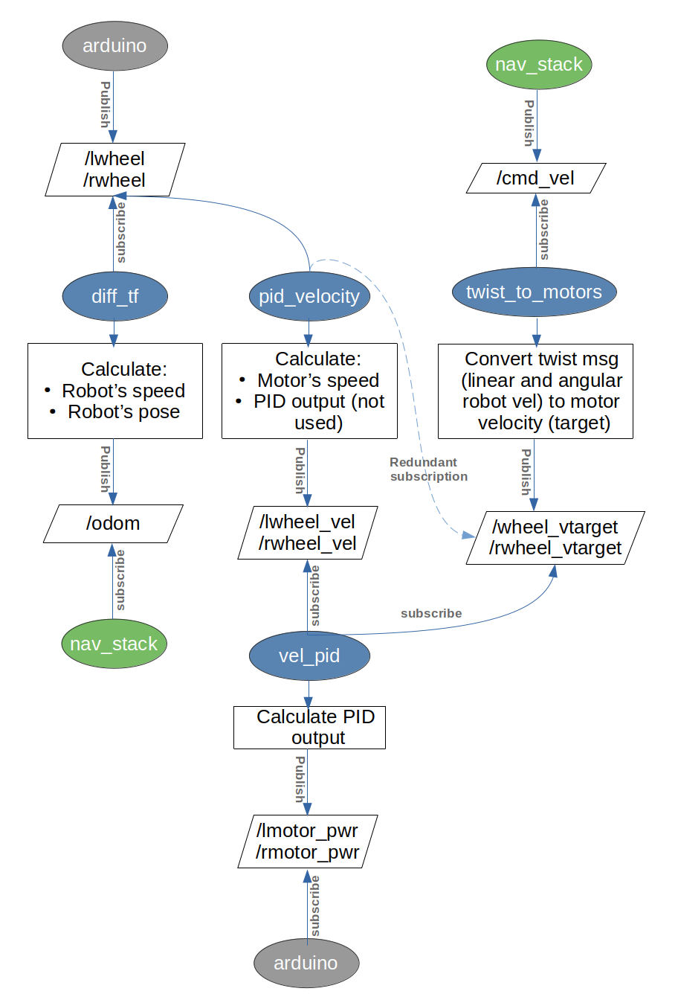

# Old Control Architecture Breakdown
In this document, the control architecture used by the previous development team will be broken-down, and areas in need of optimization will be discussed.

## Overview
 
As shown in the above diagram, the diffrential_drive package acts as middleware between the high-level control represented by the navigation stack (although other packages are included, only nav_stack is mentioned for brevity), and low-level control represented by the node on the Arduino

The diffrential_drive package takes in the velocity setpoint (/cmd_vel) from the navigation stack, as well as the encoder ticks (/lwheel and /rwheel) from the Arduino. It uses them to perform the PID calculations and output the PWM commands (/lmotor_pwr ans /rmotor_pwr) to the motors through the Arduino.

## Detailed Explanantion
The below diagram describes this process in greater detail:

 

- The Arduino publishes the encoder ticks to the topics /lwheel and /rwheel
- Nav_stack publishes the linear and angular velocity setpoint of the robot (as twist msg) to the topic /cmd_vel
- The twist_to_motors node subscribes to the /cmd_vel topic and uses inverse kinematics to get the target velocity of each motor, and publishes those target velocities to the topics /lwheel_vtarget and /rwheel_vtarget

- The diff_tf node (from the diffrential_drive package) subscribes to the encoder ticks topics and calculates the the robot's speed and pose, then publishes them to the odometry transform topic /odom
- The diff_tf node (from the diffrential_drive package) subscribes to the encoder ticks topics and uses them along with kinematics to calculate the robot's velocity and pose, then publishes the calculated velocity and pose as odom msg on the /odom topic, to which the nav_stack subscribes to perform the navigation processes (to be more specific, the ekf node subscribes first to filter the odometry data, then nav_stack subscribes to the filtered odometry topic)

- The pid_velocity node subscribes to the encoder ticks topics as well as the  target velocities topic (although the latter is a redundancy as discussed later), and calculates the actual velocity of each motor from its encoder readings, and publishes the actual velocities to /lwheel_vel and /rwheel_vel (note that this node also calculates the PID output, but it's discarded which is, again, a redundancy which will be discussed later)
- The vel_pid node subscribes to the actual motor velocity topics as well as the target motor velocity topics and performs the PID algorithm to calculate the PWM signal to send to the motors. It publishes the PWM values to the topics /lmotor_pwr and /rmotor_pwr

- The Arduino subscribes to the PWM topics and send these values to the motor drivers

## Redundancies
- As might be noticed, there are two PID nodes, why? Theprevious developers found that the original PID node provided by the package (pid_velocity) didn't meet their expectations, thus they built another node (vel_pid). However, they kept the original node fully functioning, thus the PID algorithm is performed twice. This can be easily solved by reducing the original node to only actual_velocity calculation, or by removing the node altogether and adding the actual_velocity calculation to the custom vel_pid node.
- The Arduino sketch can be found to do other tasks other than reading and publishing the encoder ticks, and subscribing to and assigning the PWM signals. What are these tasks and why are they there? These are redundant tasks that basically uses the encoder ticks to calculate the rotational velocity of each motor and puts them in an array and publish this array to the topic /joint_state_from_arduino. This topic is unused. The reason for its existence is because earlier developers tried to use ros_control for the control architecture, but the endeavor didn't go well and the last year developers cancelled it. However, using ros_control required following pre-defined interfaces which included the joint_states_interface. That's why this array was sent because it was then recieved by the ros_control hardware_interfacing node. And since this node is now removed, this section in the Arduino sketch should be removed as well.
