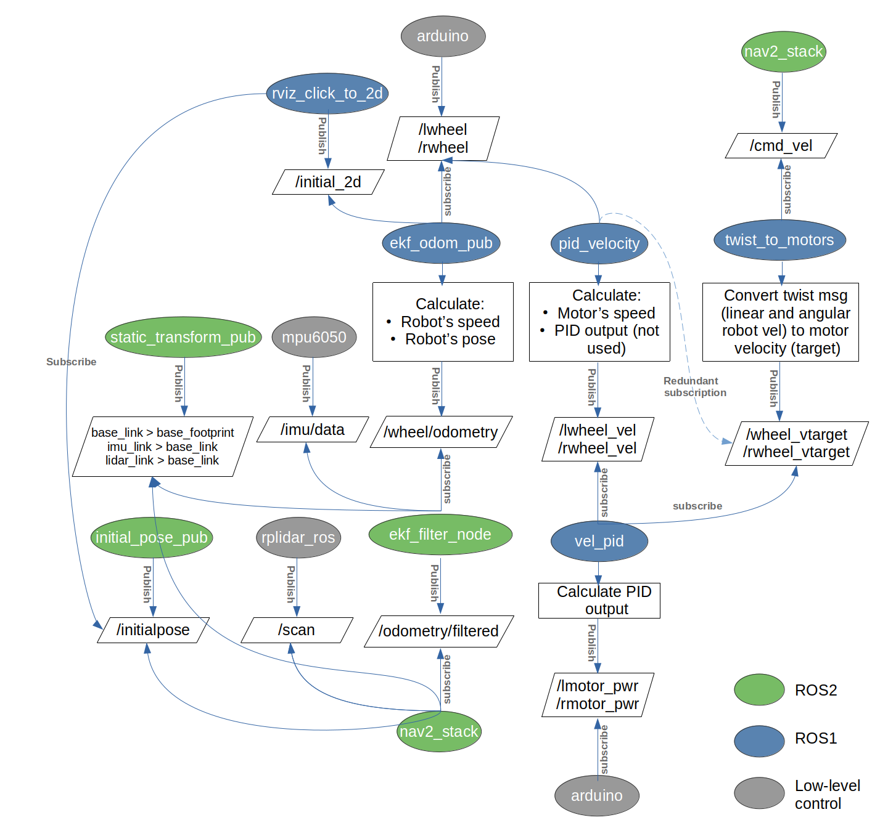

# How To Run The Robot's Software
The robot's software uses both ROS1 and ROS2, thus to run the robot's software, a launch file for ROS1 nodes, another for ROS2 nodes, and ros1_bridge are used.


## Brief Steps
1. In the first terminal, source ROS1* then run roscore
2. In the second terminal, source ROS1, then source the workspace files (inside ROS1 workspace: ros1_ws, then launch the ros1 launch file: 
	`. devel/setup.bash`
	`roslaunch differential_drive middleware_no_urdf.launch`
3. In the third terminal, source ROS1, then source ROS2, then run ros1_bridge*
4. In the fourth terminal, source ROS2*, then source the workspace files (inside ROS2 workspace: grad_proj_ws), then launch the ros2 launch file: 
	`. install/setup.bash`
	`ros2 launch physical_robot nav_no_urdf.launch.py`

* To make sourcing and running ros1_bridge easier, you can use aliasing: this allows you to use an alias of choice instead of a terminal command. To create an alias, open the .bashrc file and type `alias <alias_name>='<command>'`
These are recommended aliases:
```
alias foxy='. /opt/ros/foxy/setup.bash'
alias noetic='. /opt/ros/noetic/setup.bash'
alias ros1bridge='ros2 run ros1_bridge dynamic_bridge'
```
## The Launch Files Content
**ROS1**
1. rosserial: Communicates with Arduino Mega which publishes `/lwheel` and `/rwheel` topics and subscribes to `/lwheel_pwr` and `/rwheel_pwr` topics
2. rviz_click_to_2d: Converts the type of the initial pose msg. Subscribes to `/initialpose` abd publishes `/initial_2d`
3. ekf_odom_pub: Converts the encoder ticks to odometry msg. Subscribes to `/lwheel`, `/rwheel`, and `/initial_2d`. Publishes `/wheel/odometry`
4. twist_to_motors: Subscribes to `/cmd_vel` and convert it to the required velocities from each wheel. Publishes `/lwheel_vtarget` and `/rwheel_vtarget`
5. motion_control, lpid_velocity, and rpid_velocity: Subscribes to `/lwheel` and `/rwheel` to calculate the motors' velocities, and to `/lwheel_vtarget` and `/rwheel_vtarget` which are the setpoints, then performs PID algorithm and publishes the PWM signals to the motors on the topics `/lwheel_pwr` and `/rwheel_pwr`
6. mpu6050_serial_to_imu_node: Publishes the imu data on `/imu/data`

**ROS2**
1. ekf_filter_node: Sensor fusion for the imu and wheel encoder data for more accurate localization. Subscribes to `/wheel/odometry`, `/imu/data`, and `/tf2_static` (static transforms)
2. initial_pose_pub: Publishes the initial pose once to the topic `/initialpose` after 15 sec from launching, to ensure the subscribed nodes have been launched and ready to recieve the message
3. static_transform_publisher: Publishes the following static transforms to `/tf2_static`: base_link >> base_footprint, lidar_link >> base_link, imu_link >> base_link
4. rplidar_ros: Operates the lidar. Publishes the laser scan data to `/scan`
5. rviz2: For visualization purposes as well as to send goals while testing
6. nav2_bringup: Another launch file that launches several Nav2 nodes responsible forlocalization, global planning, and local planning. Publishes `/cmd_vel`

*Note that this architecture doesn't use robot_state_publisher nor urdf to export the robot's transforms. It relys on the static_transform_publisher instead.*


## The Current Control Architecture
The following chart describes the current control architecture:

 

## Inefficiencies And Future Modifications
Aside from the ineffiecincies mentioned in the old_control_architecure document, the control architecture also has the following inefficiencies:
- The rviz_click_to_2d node's sole purpose is transforming the type of message from PoseWithCovarienceStamped to PoseStamped for the ekf_odom_pub to be able to use it. This can be eliminated by changing the type message the ekf_odom_pub recieves, or by publishing the `/initial_2d` topic from the initial_pose_pub node
- The control architecure doesn't follow standard approaches of using robot_state_publisher and joint_state_publisher. This might affect the sensor fusion behaviour  


## Simulating The Robot's Control Architecture
To run the robot's software and simulate its behaviour without connection to the robot's hardware (for software testing and debugging purposes), the package sensors_sim was created, and dedicated ROS2 launch file was made. The sensors_sim package publishes fake encoder ticks to the `/lwheel` and `/rwheel` topics. The script also is prepared to publish imu data and laser scans, but this option is commented out as the Gazebo simulated imu and laser scan have better performance. 
The package also contains a script to publish twist messages to `/cmd_vel` topic as the fake data result in the nav2_stack being stuck unable to publish continous messages to the topic.
The dedicated launch includes the script publishing the fake sensors data, and launches Gazebo to publish imu and laser scan data. Note that the Gazebo model is modified to not publish anything other than the imu and laser scan data.
To run this simulated behaviour, follow the exact steps above, but run the ROS2 simulation-oriented launch file instead:
`ros2 launch physical_robot nav_no_urdf_sensors_sim.launch.py`
To test sending command velocities, open a new terminal and source ROS2 and the workspace, then run the aforementioned script:
`ros2 run sensors_sim cmd_vel_talker`
