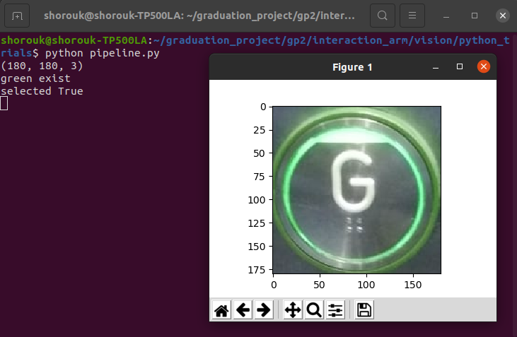
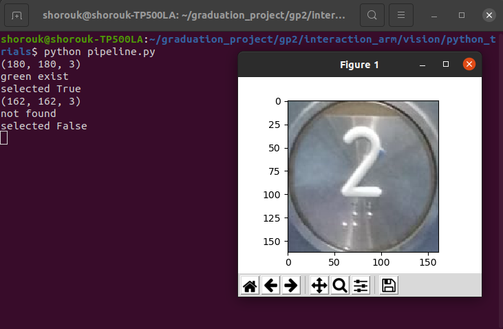

## Elevator buttons detection pipeline

This repo includes experimental pipeline for isolating elevator buttons and detecting whether they are selected or not using opencv
the isolated buttons can then be passed to a classifier to detect the button type or number

### Scripts contents

- *circle_detection_and_cropping*
Experimental script to detect the buttons as circles and isolate each button in a separate image

- *button_isolation*
Defines the function that detects the buttons and isloates them into separate images. Its parameters are the input image, and other optional parameters for tuning the Hough transform circle detection.
Returns a list of images of found buttins

- *selection_color_detection_trackbar*
An experimental script to tune the detection of green color indicator of buttons selection. Trackbars are used to ease the tuning process.

- *selection_color_detection*
Defines the function that takes an image as paramater ,along optional parameters for further tuning of the detector, and returns a masked area showing the detected area only and a boolean variable indicating whether the button is detected as selected or not

- *pipeline*
A preprocessing pipeline that takes an image and then pass through the aforementioned functions. The buttons are to be separated and each button is initially classified as selected or not

### Example of the pipeline's processing result

Each button in the image is isolated then its state (selected or not selected) is printed on the terminal

The case of a selected button:
 

The case of an unselected button:
 